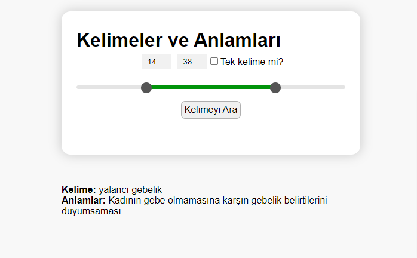

  

# Kelime Arama Projesi

Bu proje, bir metin dosyasındaki kelimelerden rastgele birini seçerek, bu kelimenin anlamını TDK (Türk Dil Kurumu) API'si aracılığıyla getiren bir uygulamadır. Proje, HTML, CSS ve JavaScript kullanılarak geliştirilmiştir.

## Projenin Çalışma Mantığı

1. **Kelime Seçimi**: 
   - `TDK_Sözlük_Kelime_Listesi.txt` dosyasında her satırda bir kelime bulunmaktadır.
   - Kullanıcı, minimum ve maksimum kelime uzunluğunu belirleyerek ve isterse "Tek kelime mi?" seçeneğini işaretleyerek belirli kriterlere göre kelime arayabilir.
   - Belirtilen kriterlere uygun rastgele bir kelime seçilir.

2. **Anlam Getirme**:
   - Seçilen kelime, TDK API'sine gönderilir ve kelimenin anlamları getirilir.
   - Anlamlar, kullanıcıya gösterilir.

## Gereksinimler

Bu proje, dosya okuma işlemleri içerdiğinden dolayı yerel bir sunucu üzerinde çalıştırılmalıdır. Projeyi çalıştırmak için aşağıdaki araçlardan birini kullanabilirsiniz:
- Visual Studio Code Live Server eklentisi
- XAMPP
- Laragon

## Kullanım

### Kurulum

1. Proje dosyalarını bilgisayarınıza indirin veya klonlayın.
2. Proje klasörünü yerel sunucu üzerinde çalıştırın.

### Kullanım Adımları

1. `index.html` dosyasını yerel sunucu üzerinden açın.
2. Minimum ve Maksimum giriş kutularında kelime uzunluğu aralığını ayarlayın.
3. "Tek kelime mi?" seçeneğini işaretleyerek sadece tek kelime aramalarını etkinleştirin.
4. "Kelimeyi Ara" butonuna tıklayarak rastgele bir kelime ve anlamlarını görün.

### Örnek Kullanım

Projeyi çalıştırdıktan sonra, "Kelimeyi Ara" butonuna tıkladığınızda rastgele bir kelime seçilecek ve TDK API'si kullanılarak anlamları gösterilecektir.

## Proje Yapısı

- `index.html`: Ana HTML dosyası.
- `style.css`: Stil dosyası.
- `script.js`: JavaScript dosyası.
- `TDK_Sözlük_Kelime_Listesi.txt`: TDK kelime listesi dosyası.

## Katkıda Bulunma

Katkıda bulunmak isterseniz, lütfen bir `fork` oluşturun, değişikliklerinizi yapın ve ardından bir `pull request` gönderin.

## Lisans

Bu proje MIT lisansı altında lisanslanmıştır. Daha fazla bilgi için [`LICENSE`](https://github.com/Abdullah-Yilmazer/TDK-API?tab=MIT-1-ov-file) dosyasına bakın.
